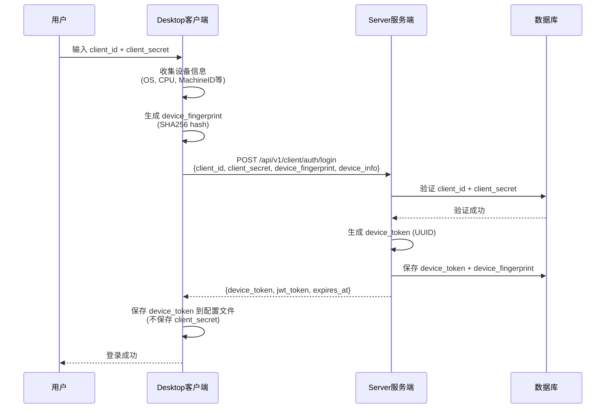
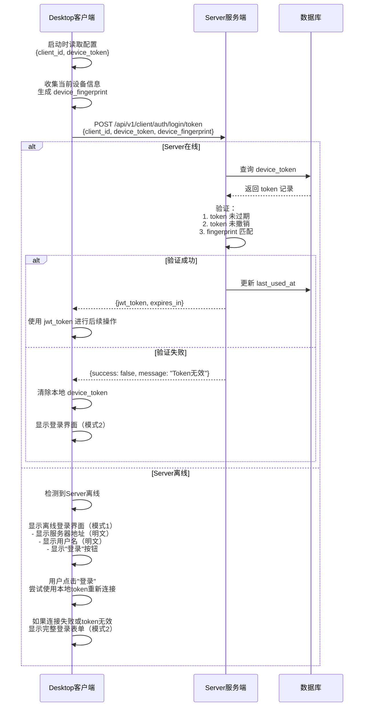
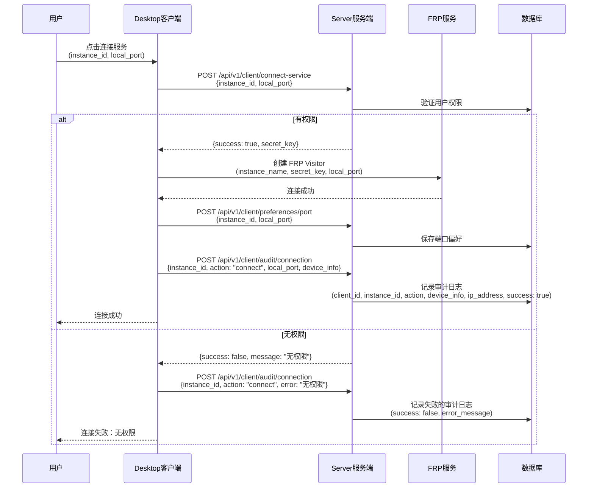
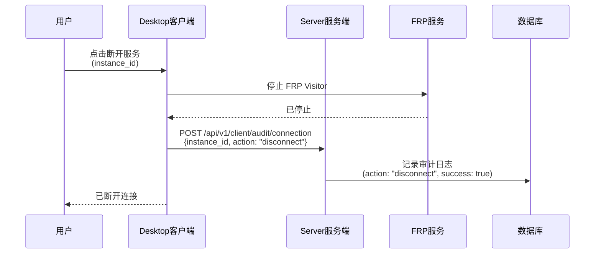
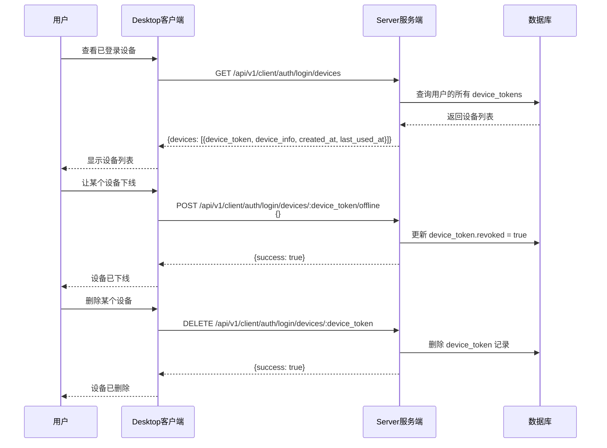
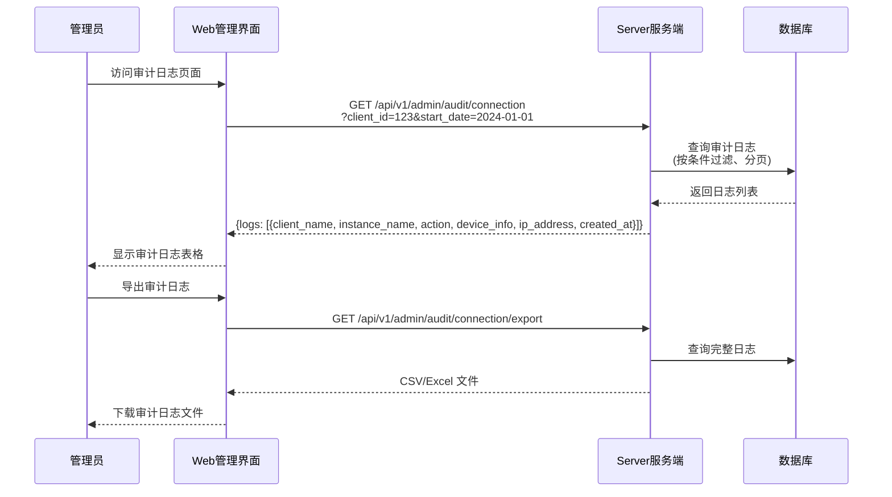

# 安全令牌与审计日志设计文档

## 1. 概述

本文档描述了两个关键的安全和审计改进：

1. **安全令牌系统（Device Token）**：替代 Desktop 客户端明文存储 secret 的方案
2. **审计日志系统**：记录用户连接行为和端口偏好的服务端日志

## 2. 问题分析

### 2.1 当前安全问题

**问题描述**：Desktop 客户端在"记住登录"功能中明文存储了`client_secret`到本地配置文件。

**风险**：

- 任何能访问用户文件系统的程序都能读取 secret
- Secret 泄露后攻击者可以完全冒充用户
- 违反了基本的安全最佳实践

### 2.2 当前审计问题

**问题描述**：端口偏好保存在 Desktop 客户端本地，服务端无法追踪：

- 无法知道哪个用户连接了哪个服务
- 无法审计用户的连接历史
- 无法进行安全分析和异常检测

## 3. 解决方案设计

### 3.1 安全令牌系统（Device Token）

#### 3.1.1 核心思路

使用**设备令牌（Device Token）**替代明文 secret 存储：

1. 用户首次登录时使用`client_id` + `client_secret`认证
2. 认证成功后，服务端生成一个**设备令牌（Device Token）**
3. 设备令牌绑定到设备的硬件指纹（CPU、系统版本等静态信息）
4. Desktop 客户端只保存设备令牌，不保存 secret
5. 后续登录使用设备令牌进行认证
6. 设备令牌有 7 天有效期，过期后需要重新使用 secret 登录

#### 3.1.2 设备指纹（Device Fingerprint）

收集以下设备静态信息生成指纹：

- OS：操作系统（windows/linux/darwin）
- OSVersion：系统版本（Windows 10, Ubuntu 22.04）
- Arch：架构（amd64/arm64）
- CPUModel：CPU 型号
- MachineID：机器 ID（从系统获取）
- Hostname：主机名

**指纹生成算法**：SHA256(OS + OSVersion + Arch + CPUModel + MachineID + Hostname)

#### 3.1.3 Desktop 客户端配置变更

**新的配置文件格式**：

```json
{
  "server": "localhost:9090",
  "client": "user@example.com",
  "token": "dt_uuid-generated-by-server"
}
```

**设计原则**：

- ✅ 配置文件中不再存储密码（`secret`）
- ✅ `token` 由服务器生成，客户端只负责存储和使用
- ✅ 设备指纹实时计算，不需要存储
- ✅ Token 过期时间存储在服务器数据库，客户端不需要知道
- ✅ 通过 `token` 是否存在判断是否"记住登录"
- ✅ Token 失效后，清除 `token`，但保留 `server` 和 `client`
- ✅ 端口偏好迁移到服务端
- ✅ 字段名简洁，不暴露内部设计

**安全验证流程**：

客户端发送：`token` + 实时计算的设备指纹

服务器验证：

1. 查询数据库中的 `token`
2. 检查是否过期（数据库中的 `expires_at`）
3. 检查是否撤销（数据库中的 `revoked`）
4. 验证设备指纹是否匹配（数据库中的 `device_fingerprint`）

#### 3.1.4 Desktop 登录界面双模式设计

Desktop 客户端支持两种登录界面模式，根据不同场景自动切换：

**模式 1：离线状态显示（Server 离线但有有效 Token）**

当满足以下条件时显示：

- 本地配置文件中存在有效的`device_token`（未过期）
- 无法连接到 Server（网络故障或 Server 离线）

界面显示内容：

```
┌─────────────────────────────────────┐
│  AWECloud Desktop                   │
├─────────────────────────────────────┤
│  服务器地址:                        │
│  localhost:9090                     │  ← 明文显示
│                                     │
│  用户名:                            │
│  user@example.com                   │  ← 明文显示
│                                     │
│  ⚠️ 无法连接到服务器                │
│                                     │
│  [登录]                             │  ← 点击尝试重新连接
└─────────────────────────────────────┘
```

**说明**：

- 不显示密码输入框（使用本地保存的 device_token）
- 不显示加密的 token 信息（避免混淆用户）
- 点击"登录"按钮时，自动尝试使用本地 token 连接
- 如果连接失败或 token 无效，自动切换到模式 2

**模式 2：完整登录表单（正常登录流程）**

当满足以下任一条件时显示：

- 本地没有保存的`device_token`
- `device_token`已过期
- `device_token`验证失败（被撤销）
- 用户在模式 1 中点击"登录"后连接失败
- Server 在线且需要用户输入凭据

界面显示内容：

```
┌─────────────────────────────────────┐
│  AWECloud Desktop - 登录            │
├─────────────────────────────────────┤
│  服务器地址:                        │
│  [localhost:9090              ]     │  ← 如果勾选过"记住"，自动填充
│                                     │
│  用户名:                            │
│  [user@example.com            ]     │  ← 如果勾选过"记住"，自动填充
│                                     │
│  密码:                              │
│  [********************        ]     │  ← 始终需要重新输入
│                                     │
│  ☑ 记住登录                         │  ← 保持之前的勾选状态
│                                     │
│  [登录]                             │
└─────────────────────────────────────┘
```

**说明**：

- 如果用户之前勾选了"记住登录"，服务器地址和用户名会自动填充
- 密码始终不保存，需要重新输入
- "记住登录"复选框保持之前的勾选状态

**模式切换逻辑**：

1. 检查是否有保存的 token
   - 没有 token：显示完整登录表单，自动填充 server 和 client
2. 尝试连接 Server
   - Server 离线：显示离线状态
   - Server 在线：尝试使用 token 登录
3. Token 验证失败：清除 token，显示完整登录表单
4. Token 验证成功：直接进入主界面

**ClearToken 方法**：只清除 token，保留 server 和 client

### 3.2 审计日志系统

#### 3.2.1 核心思路

将端口偏好和连接记录保存到服务端，实现：

1. 用户的端口偏好云端同步（跨设备）
2. 完整的连接审计日志
3. 异常行为检测基础

## 4. 设备管理设计

### 4.1 设备识别与记录

**核心原则**：一台物理设备只对应一条设备记录

**设备识别逻辑**：

1. 通过设备指纹（Device Fingerprint）识别设备
2. 设备指纹基于硬件信息生成（OS、CPU、MachineID、Hostname 等）
3. 同一台物理设备的指纹是固定的

**设备记录管理**：

Server 端维护一个设备表（`device_tokens`），记录：

- `client_id`：用户 ID
- `device_fingerprint`：设备指纹（唯一标识物理设备）
- `device_token`：当前有效的令牌（会更新）
- `device_info`：设备基础信息（OS、Arch、Hostname 等）
- `created_at`：首次登录时间
- `last_used_at`：最后使用时间
- `expires_at`：令牌过期时间
- `revoked`：是否已撤销

### 4.2 常见场景处理

#### 场景 1：首次登录

- Desktop 收集设备信息，生成设备指纹
- Server 检查该用户是否有相同指纹的设备记录
- **没有记录**：创建新的设备记录，生成 token
- 结果：设备列表中新增一条记录

#### 场景 2：正常的再次登录（本地有 token）

- Desktop 使用本地保存的 token 登录
- Server 验证 token 有效性和设备指纹
- 验证成功：更新 `last_used_at`
- 结果：设备列表中该记录的"最后使用"时间更新

#### 场景 3：清理本地数据后重新登录

- 用户清理了 Desktop 的本地配置文件（删除了 token）
- Desktop 重新收集设备信息，生成设备指纹（与之前相同）
- 用户使用密码重新登录
- Server 检查该用户是否有相同指纹的设备记录
- **找到旧记录**：生成新的 token，更新这条记录
- 结果：设备列表中**不会新增记录**，只是更新了 token 和时间

#### 场景 4：更换硬件或重装系统

- 设备指纹发生变化（CPU 更换、MachineID 改变等）
- Desktop 生成新的设备指纹
- Server 检查该用户是否有相同指纹的设备记录
- **没有记录**：创建新的设备记录
- 结果：设备列表中新增一条记录（旧设备记录仍然存在）

#### 场景 5：同一用户在不同设备登录

- 不同物理设备的指纹不同
- Server 为每台设备创建独立的记录
- 结果：设备列表中有多条记录

#### 场景 6：用户主动让设备下线

- 用户在"我的设备"页面点击"下线"
- Server 将该设备记录标记为 `revoked=true`
- 该设备的 token 立即失效
- 结果：该设备无法再使用旧 token 登录，需要重新输入密码

#### 场景 7：用户删除设备记录

- 用户在"我的设备"页面点击"删除"
- Server 从数据库中删除该设备记录
- 如果该设备再次登录，会创建新的记录
- 结果：设备列表中该记录消失

### 4.3 设备列表展示

Desktop 和 Web 管理界面中的"我的设备"页面显示：

- 设备信息：OS、架构、主机名
- 状态：在线/离线
- 最后使用时间
- 创建时间
- 当前设备标识（标记当前正在使用的设备）
- 操作按钮：下线、删除

**设备去重逻辑**：

- 同一台物理设备只显示一条记录
- 通过设备指纹去重
- 即使用户多次清理本地数据重新登录，也只显示一条记录

## 5. 业务流程设计

### 5.1 首次登录流程



### 5.2 自动登录流程（使用 Device Token）



### 5.3 连接服务流程（含审计日志）



### 5.4 断开服务流程



### 5.5 Device Token 管理流程



### 5.6 管理员查询审计日志流程



## 6. 安全性分析

### 6.1 Device Token 安全性

**优势**：

1. ✅ 不在客户端存储 secret
2. ✅ Token 绑定设备，无法跨设备使用
3. ✅ 有明确的过期时间（7 天）
4. ✅ 用户可以随时撤销
5. ✅ 管理员可以审计和管理

**潜在风险与缓解**：

1. **设备指纹伪造**：攻击者可能尝试伪造设备指纹
   - 缓解：使用多个硬件特征组合，增加伪造难度
   - 缓解：记录 IP 地址，检测异常登录位置
2. **Token 泄露**：Token 文件被读取

   - 缓解：Token 只能在同一设备使用（指纹验证）
   - 缓解：7 天自动过期
   - 缓解：用户可以远程撤销

3. **中间人攻击**：Token 在传输中被截获
   - 缓解：必须使用 HTTPS/TLS 加密传输
   - 缓解：Token 有效期短

### 6.2 审计日志安全性

**优势**：

1. ✅ 完整记录用户行为
2. ✅ 支持异常检测
3. ✅ 满足合规要求
4. ✅ 便于事后调查

**注意事项**：

1. 审计日志本身需要保护，防止篡改
2. 需要定期归档和清理旧日志
3. 敏感信息（如 IP 地址）需要符合隐私法规

## 7. API 接口列表

详细的 API 设计请参考 `docs/design_api.md`。

### 7.1 Device Token 相关接口

- `POST /api/v1/client/auth/login` - 使用 Secret 登录并获取 Device Token
- `POST /api/v1/client/auth/login/token` - 使用 Device Token 登录
- `GET /api/v1/client/auth/login/devices` - 列出用户已登录的设备
- `POST /api/v1/client/auth/login/devices/:device_token/offline` - 让设备下线（撤销 Token）
- `DELETE /api/v1/client/auth/login/devices/:device_token` - 删除设备记录

### 7.2 端口偏好相关接口

- `GET /api/v1/client/preferences/port` - 获取端口偏好
- `POST /api/v1/client/preferences/port` - 保存端口偏好

### 7.3 审计日志相关接口

- `POST /api/v1/client/audit/connection` - 记录连接审计日志
- `GET /api/v1/admin/audit/connection` - 查询连接审计日志（管理员）
- `GET /api/v1/admin/audit/connection/export` - 导出审计日志（管理员）

## 8. 数据库设计

详细的数据库设计请参考 `docs/design_database.md`。

### 8.1 新增表

- `device_tokens` - 设备令牌表
- `port_preferences` - 用户端口偏好表
- `connection_audit_logs` - 连接审计日志表

## 9. 监控和告警

### 9.1 关键指标

- Device Token 创建/撤销数量
- 认证失败次数（按原因分类）
- 异常登录检测（不同设备/IP）
- 审计日志写入速率

### 9.2 告警规则

- 同一用户短时间内多次认证失败
- 同一用户从多个不同设备登录
- 同一用户从异常 IP 地址登录
- Device Token 被频繁撤销

## 10. 总结

本设计通过引入 Device Token 系统和审计日志系统，解决了两个关键问题：

1. **安全性**：消除了明文存储 secret 的风险，使用设备绑定的 Token 机制
2. **可审计性**：完整记录用户连接行为，支持安全分析和合规要求

这两个系统相互配合，既提升了安全性，又增强了系统的可管理性和可追溯性。

---

**文档版本**: 1.1  
**最后更新**: 2025-12-01  
**变更说明**: 精简配置文件格式（3 个字段），删除实现细节章节，优化文档结构
