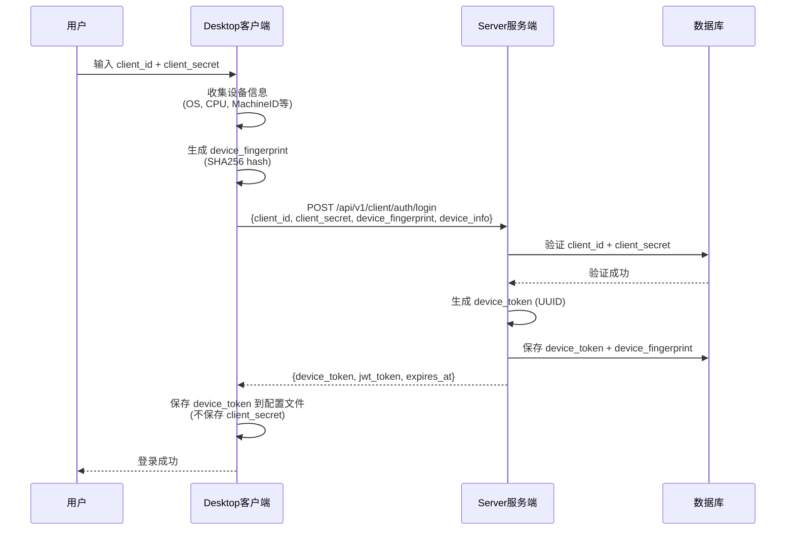
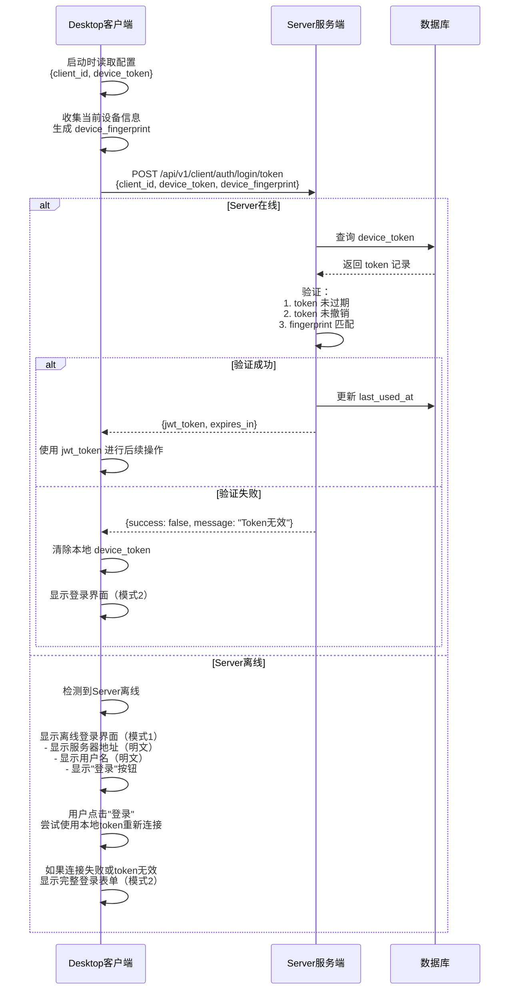
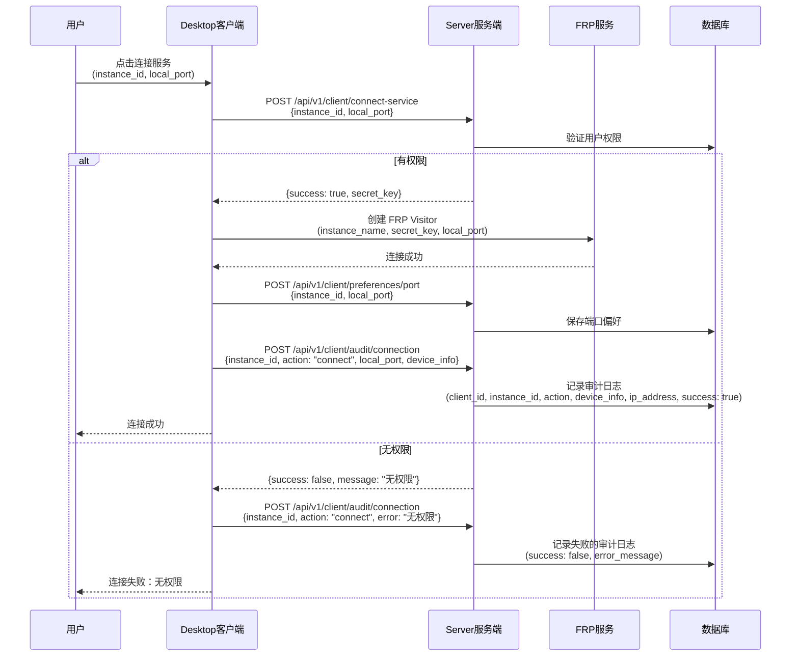
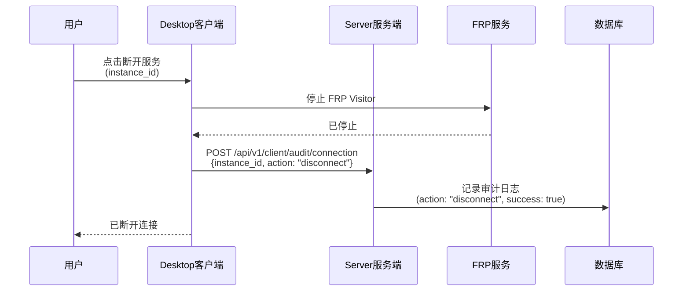
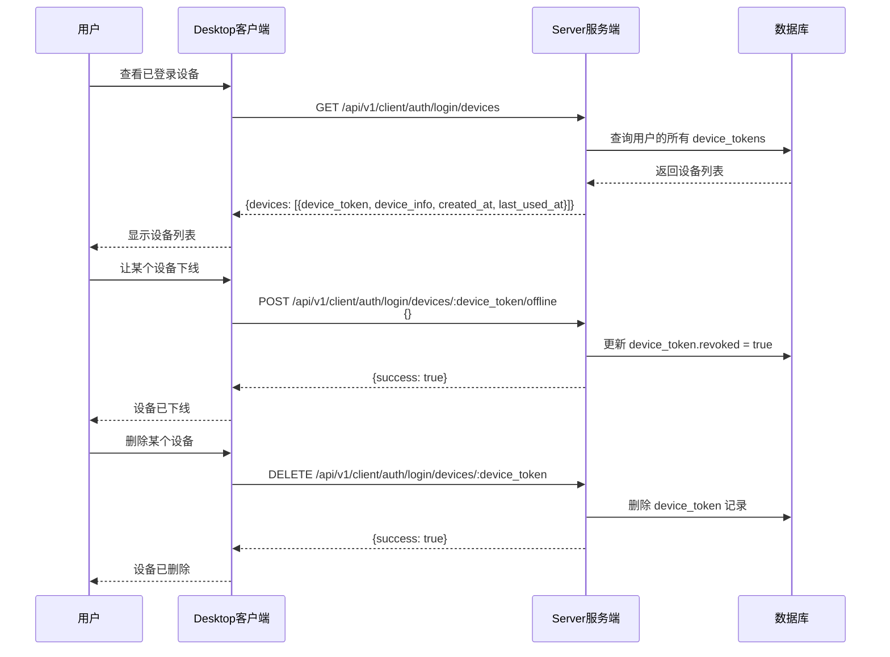
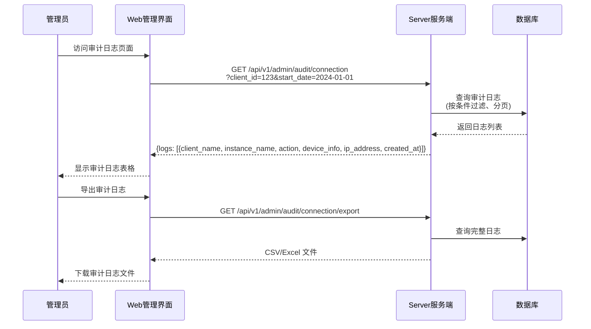

# 安全令牌与审计日志设计文档

## 1. 概述

本文档描述了两个关键的安全和审计改进：
1. **安全令牌系统（Device Token）**：替代Desktop客户端明文存储secret的方案
2. **审计日志系统**：记录用户连接行为和端口偏好的服务端日志

## 2. 问题分析

### 2.1 当前安全问题

**问题描述**：Desktop客户端在"记住登录"功能中明文存储了`client_secret`到本地配置文件。

**风险**：
- 任何能访问用户文件系统的程序都能读取secret
- Secret泄露后攻击者可以完全冒充用户
- 违反了基本的安全最佳实践

### 2.2 当前审计问题

**问题描述**：端口偏好保存在Desktop客户端本地，服务端无法追踪：
- 无法知道哪个用户连接了哪个服务
- 无法审计用户的连接历史
- 无法进行安全分析和异常检测

## 3. 解决方案设计

### 3.1 安全令牌系统（Device Token）

#### 3.1.1 核心思路

使用**设备令牌（Device Token）**替代明文secret存储：

1. 用户首次登录时使用`client_id` + `client_secret`认证
2. 认证成功后，服务端生成一个**设备令牌（Device Token）**
3. 设备令牌绑定到设备的硬件指纹（CPU、系统版本等静态信息）
4. Desktop客户端只保存设备令牌，不保存secret
5. 后续登录使用设备令牌进行认证
6. 设备令牌有7天有效期，过期后需要重新使用secret登录

#### 3.1.2 设备指纹（Device Fingerprint）

收集以下设备静态信息生成指纹：

```go
type DeviceFingerprint struct {
    OS           string // 操作系统：windows/linux/darwin
    OSVersion    string // 系统版本：Windows 10, Ubuntu 22.04
    Arch         string // 架构：amd64/arm64
    CPUModel     string // CPU型号
    MachineID    string // 机器ID（从系统获取）
    Hostname     string // 主机名
}
```

**指纹生成算法**：
```
fingerprint_hash = SHA256(OS + OSVersion + Arch + CPUModel + MachineID + Hostname)
```

#### 3.1.3 Desktop客户端配置变更

**新的配置文件格式**：

```json
{
  "server_address": "localhost:9090",
  "client_id": "user@example.com",
  "device_token": "uuid-generated-token",     // 替代 client_secret（可选）
  "device_fingerprint": "sha256-hash",        // 设备指纹（可选）
  "remember_me": true,
  "token_expires_at": 1704628800              // Token过期时间（可选）
}
```

**注意**：
- 配置文件中不再存储`client_secret`！
- 如果用户勾选"记住登录"，至少保存`server_address`和`client_id`
- `device_token`、`device_fingerprint`和`token_expires_at`仅在token有效时存在
- Token失效后，这些字段会被清除，但保留`server_address`和`client_id`
- 端口偏好也将迁移到服务端

#### 3.1.4 Desktop登录界面双模式设计

Desktop客户端支持两种登录界面模式，根据不同场景自动切换：

**模式1：离线状态显示（Server离线但有有效Token）**

当满足以下条件时显示：
- 本地配置文件中存在有效的`device_token`（未过期）
- 无法连接到Server（网络故障或Server离线）

界面显示内容：
```
┌─────────────────────────────────────┐
│  AWECloud Desktop                   │
├─────────────────────────────────────┤
│  服务器地址:                        │
│  localhost:9090                     │  ← 明文显示
│                                     │
│  用户名:                            │
│  user@example.com                   │  ← 明文显示
│                                     │
│  ⚠️ 无法连接到服务器                │
│                                     │
│  [登录]                             │  ← 点击尝试重新连接
└─────────────────────────────────────┘
```

**说明**：
- 不显示密码输入框（使用本地保存的device_token）
- 不显示加密的token信息（避免混淆用户）
- 点击"登录"按钮时，自动尝试使用本地token连接
- 如果连接失败或token无效，自动切换到模式2

**模式2：完整登录表单（正常登录流程）**

当满足以下任一条件时显示：
- 本地没有保存的`device_token`
- `device_token`已过期
- `device_token`验证失败（被撤销）
- 用户在模式1中点击"登录"后连接失败
- Server在线且需要用户输入凭据

界面显示内容：
```
┌─────────────────────────────────────┐
│  AWECloud Desktop - 登录            │
├─────────────────────────────────────┤
│  服务器地址:                        │
│  [localhost:9090              ]     │  ← 如果勾选过"记住"，自动填充
│                                     │
│  用户名:                            │
│  [user@example.com            ]     │  ← 如果勾选过"记住"，自动填充
│                                     │
│  密码:                              │
│  [********************        ]     │  ← 始终需要重新输入
│                                     │
│  ☑ 记住登录                         │  ← 保持之前的勾选状态
│                                     │
│  [登录]                             │
└─────────────────────────────────────┘
```

**说明**：
- 如果用户之前勾选了"记住登录"，服务器地址和用户名会自动填充
- 密码始终不保存，需要重新输入
- "记住登录"复选框保持之前的勾选状态

**模式切换逻辑**：

```go
func DetermineLoginMode(config *Config) LoginMode {
    // 检查是否有保存的token
    if config.DeviceToken == "" {
        // 没有token，显示完整登录表单
        // 但如果remember_me=true，会自动填充server_address和client_id
        return MODE_FULL_LOGIN
    }
    
    // 检查token是否过期
    if time.Now().Unix() > config.TokenExpiresAt {
        // Token过期，清除token相关字段，但保留server_address和client_id
        config.ClearToken()  // 只清除token，不清除基本信息
        config.Save()
        return MODE_FULL_LOGIN
    }
    
    // 尝试连接Server
    if !CanConnectToServer(config.ServerAddress) {
        return MODE_OFFLINE_DISPLAY
    }
    
    // Server在线，尝试使用token登录
    success, err := LoginWithToken(config.DeviceToken)
    if err != nil || !success {
        // Token验证失败，清除token相关字段，但保留server_address和client_id
        config.ClearToken()
        config.Save()
        return MODE_FULL_LOGIN
    }
    
    // Token验证成功，直接进入主界面
    return MODE_AUTO_LOGIN
}

// ClearToken 清除token相关字段，但保留基本信息
func (c *Config) ClearToken() {
    c.DeviceToken = ""
    c.DeviceFingerprint = ""
    c.TokenExpiresAt = 0
    // 保留 ServerAddress, ClientID, RememberMe
}
```

### 3.2 审计日志系统

#### 3.2.1 核心思路

将端口偏好和连接记录保存到服务端，实现：
1. 用户的端口偏好云端同步（跨设备）
2. 完整的连接审计日志
3. 异常行为检测基础

## 4. 业务流程设计

### 4.1 首次登录流程



### 4.2 自动登录流程（使用Device Token）



### 4.3 连接服务流程（含审计日志）



### 4.4 断开服务流程



### 4.5 Device Token管理流程



### 4.6 管理员查询审计日志流程



## 5. 安全性分析

### 5.1 Device Token安全性

**优势**：
1. ✅ 不在客户端存储secret
2. ✅ Token绑定设备，无法跨设备使用
3. ✅ 有明确的过期时间（7天）
4. ✅ 用户可以随时撤销
5. ✅ 管理员可以审计和管理

**潜在风险与缓解**：
1. **设备指纹伪造**：攻击者可能尝试伪造设备指纹
   - 缓解：使用多个硬件特征组合，增加伪造难度
   - 缓解：记录IP地址，检测异常登录位置
   
2. **Token泄露**：Token文件被读取
   - 缓解：Token只能在同一设备使用（指纹验证）
   - 缓解：7天自动过期
   - 缓解：用户可以远程撤销

3. **中间人攻击**：Token在传输中被截获
   - 缓解：必须使用HTTPS/TLS加密传输
   - 缓解：Token有效期短

### 5.2 审计日志安全性

**优势**：
1. ✅ 完整记录用户行为
2. ✅ 支持异常检测
3. ✅ 满足合规要求
4. ✅ 便于事后调查

**注意事项**：
1. 审计日志本身需要保护，防止篡改
2. 需要定期归档和清理旧日志
3. 敏感信息（如IP地址）需要符合隐私法规

## 6. API接口列表

详细的API设计请参考 `docs/design_api.md`。

### 6.1 Device Token相关接口

- `POST /api/v1/client/auth/login` - 使用Secret登录并获取Device Token
- `POST /api/v1/client/auth/login/token` - 使用Device Token登录
- `GET /api/v1/client/auth/login/devices` - 列出用户已登录的设备
- `POST /api/v1/client/auth/login/devices/:device_token/offline` - 让设备下线（撤销Token）
- `DELETE /api/v1/client/auth/login/devices/:device_token` - 删除设备记录

### 6.2 端口偏好相关接口

- `GET /api/v1/client/preferences/port` - 获取端口偏好
- `POST /api/v1/client/preferences/port` - 保存端口偏好

### 6.3 审计日志相关接口

- `POST /api/v1/client/audit/connection` - 记录连接审计日志
- `GET /api/v1/admin/audit/connection` - 查询连接审计日志（管理员）
- `GET /api/v1/admin/audit/connection/export` - 导出审计日志（管理员）

## 7. 数据库设计

详细的数据库设计请参考 `docs/design_database.md`。

### 7.1 新增表

- `device_tokens` - 设备令牌表
- `port_preferences` - 用户端口偏好表
- `connection_audit_logs` - 连接审计日志表

## 8. 实施计划

### 8.1 第一阶段：服务端基础设施

1. 数据库迁移：创建新表
2. 实现Device Token管理模块
3. 实现设备指纹验证逻辑
4. 实现新的认证API
5. 添加定时任务清理过期Token

### 8.2 第二阶段：审计日志系统

1. 实现端口偏好API
2. 实现审计日志记录API
3. 实现审计日志查询API（管理员）
4. 添加审计日志导出功能

### 8.3 第三阶段：Desktop客户端改造

1. 实现设备指纹收集模块
2. 修改登录流程（支持Device Token和双模式）
3. 修改配置文件格式和管理逻辑
   - 实现`ClearToken()`方法（只清除token，保留基本信息）
   - 实现配置文件自动填充逻辑
   - 实现"记住登录"状态管理
4. 迁移端口偏好到服务端
5. 集成审计日志记录
6. 实现离线模式检测和自动重连

### 8.4 第四阶段：Web管理界面

1. 添加Device Token管理页面
2. 添加连接审计日志查询页面
3. 添加异常行为告警功能
4. 添加审计日志导出功能

### 8.5 第五阶段：测试与部署

1. 单元测试
2. 集成测试
3. 安全测试
4. 性能测试
5. 文档更新
6. 灰度发布

## 9. Desktop客户端实现细节

### 9.1 登录流程状态机

```
┌─────────────┐
│   启动应用   │
└──────┬──────┘
       │
       ▼
┌─────────────────┐
│ 读取本地配置文件 │
└──────┬──────────┘
       │
       ▼
    有Token?
       │
   ┌───┴───┐
   │       │
  是      否
   │       │
   │       └──────────────────┐
   │                          │
   ▼                          ▼
Token过期?              ┌──────────────┐
   │                   │ 显示模式2     │
┌──┴──┐                │ (完整登录表单) │
│     │                └──────────────┘
是    否
│     │
│     └────────────┐
│                  │
▼                  ▼
┌──────────────┐  Server在线?
│ 显示模式2     │     │
│ (完整登录表单) │  ┌──┴──┐
└──────────────┘  │     │
                 是    否
                  │     │
                  │     └──────────────┐
                  │                    │
                  ▼                    ▼
            验证Token成功?        ┌──────────────┐
                  │               │ 显示模式1     │
              ┌───┴───┐           │ (离线状态显示) │
              │       │           └──────────────┘
             是      否
              │       │
              │       └──────────────┐
              │                      │
              ▼                      ▼
        ┌──────────┐          ┌──────────────┐
        │ 进入主界面 │          │ 显示模式2     │
        └──────────┘          │ (完整登录表单) │
                             └──────────────┘
```

### 9.2 离线模式登录逻辑

在模式1（离线状态显示）中，用户点击"登录"按钮时的处理逻辑：

```go
func HandleOfflineLogin(config *Config) error {
    // 尝试连接Server
    if !CanConnectToServer(config.ServerAddress) {
        return errors.New("服务器仍然离线，请稍后重试")
    }
    
    // Server已恢复在线，使用本地token登录
    success, err := LoginWithToken(config.DeviceToken, config.DeviceFingerprint)
    if err != nil {
        // Token验证失败，清除本地token
        config.DeviceToken = ""
        config.Save()
        
        // 切换到模式2（完整登录表单）
        SwitchToFullLoginMode()
        return errors.New("登录凭据已失效，请重新输入密码")
    }
    
    if success {
        // 登录成功，进入主界面
        SwitchToMainView()
        return nil
    }
    
    return errors.New("登录失败，请重试")
}
```

### 9.3 服务器连接检测

```go
func CanConnectToServer(serverAddress string) bool {
    // 设置短超时时间（3秒）
    client := &http.Client{
        Timeout: 3 * time.Second,
    }
    
    // 尝试访问健康检查端点
    resp, err := client.Get(fmt.Sprintf("https://%s/health", serverAddress))
    if err != nil {
        return false
    }
    defer resp.Body.Close()
    
    return resp.StatusCode == 200
}
```

### 9.3 配置文件管理示例

```go
type Config struct {
    ServerAddress     string `json:"server_address"`
    ClientID          string `json:"client_id"`
    RememberMe        bool   `json:"remember_me"`
    DeviceToken       string `json:"device_token,omitempty"`
    DeviceFingerprint string `json:"device_fingerprint,omitempty"`
    TokenExpiresAt    int64  `json:"token_expires_at,omitempty"`
}

// LoadConfig 加载配置文件
func LoadConfig() (*Config, error) {
    config := &Config{}
    data, err := os.ReadFile(configPath)
    if err != nil {
        return config, err
    }
    json.Unmarshal(data, config)
    return config, nil
}

// SaveLoginSuccess 登录成功后保存配置
func (c *Config) SaveLoginSuccess(deviceToken, fingerprint string, expiresAt int64) {
    if c.RememberMe {
        // 保存所有信息
        c.DeviceToken = deviceToken
        c.DeviceFingerprint = fingerprint
        c.TokenExpiresAt = expiresAt
    } else {
        // 不记住登录，只保存临时token（应用关闭后清除）
        c.ServerAddress = ""
        c.ClientID = ""
    }
    c.Save()
}

// ClearToken 清除token但保留基本信息（如果勾选了记住）
func (c *Config) ClearToken() {
    c.DeviceToken = ""
    c.DeviceFingerprint = ""
    c.TokenExpiresAt = 0
    // 保留 ServerAddress, ClientID, RememberMe
}

// ClearAll 清除所有信息（用户取消"记住登录"）
func (c *Config) ClearAll() {
    c.ServerAddress = ""
    c.ClientID = ""
    c.RememberMe = false
    c.DeviceToken = ""
    c.DeviceFingerprint = ""
    c.TokenExpiresAt = 0
}

// ShouldAutoFill 是否应该自动填充登录表单
func (c *Config) ShouldAutoFill() bool {
    return c.RememberMe && c.ServerAddress != "" && c.ClientID != ""
}

// HasValidToken 是否有有效的token
func (c *Config) HasValidToken() bool {
    if c.DeviceToken == "" {
        return false
    }
    if time.Now().Unix() > c.TokenExpiresAt {
        return false
    }
    return true
}
```

### 9.4 配置文件安全存储

虽然不再存储`client_secret`，但`device_token`仍需要保护：

**Linux/macOS**:
```bash
# 配置文件权限设置为仅当前用户可读写
chmod 600 ~/.config/awecloud-desktop/config.json
```

**Windows**:
```go
// 使用Windows DPAPI加密存储
import "golang.org/x/sys/windows"

func EncryptToken(token string) ([]byte, error) {
    return windows.CryptProtectData([]byte(token), nil, nil, 0, nil, 0)
}

func DecryptToken(encrypted []byte) (string, error) {
    decrypted, err := windows.CryptUnprotectData(encrypted, nil, nil, 0, nil, 0)
    return string(decrypted), err
}
```

### 9.6 用户体验优化

**自动重连机制**：
```go
func AutoReconnectLoop(config *Config) {
    ticker := time.NewTicker(30 * time.Second)
    defer ticker.Stop()
    
    for range ticker.C {
        if currentMode == MODE_OFFLINE_DISPLAY {
            if CanConnectToServer(config.ServerAddress) {
                // Server恢复在线，尝试自动登录
                success, _ := LoginWithToken(config.DeviceToken)
                if success {
                    SwitchToMainView()
                }
            }
        }
    }
}
```

**Token过期提醒**：
```go
func CheckTokenExpiration(config *Config) {
    expiresAt := time.Unix(config.TokenExpiresAt, 0)
    timeUntilExpiry := time.Until(expiresAt)
    
    // 提前24小时提醒用户
    if timeUntilExpiry < 24*time.Hour && timeUntilExpiry > 0 {
        ShowNotification("您的登录即将过期，请重新登录以保持连接")
    }
}
```

## 10. 兼容性处理

### 10.1 旧版本Desktop客户端

- 保留旧的`/api/v1/client/auth`接口（标记为deprecated）
- 新接口向后兼容
- 提示用户升级客户端

### 10.2 配置文件迁移

```go
// 检测旧配置格式，自动迁移
if config.ClientSecret != "" && config.DeviceToken == "" {
    // 提示用户重新登录以获取Device Token
    // 清除旧的ClientSecret，但保留ServerAddress和ClientID
    config.ClientSecret = ""
    config.RememberMe = true  // 保持记住登录状态
    config.Save()
    
    // 显示提示信息
    ShowNotification("为了安全，请重新登录。您的服务器地址和用户名已保存。")
}
```

### 10.3 配置文件字段说明

| 字段 | 类型 | 必需 | 说明 |
|------|------|------|------|
| `server_address` | string | 是 | 服务器地址，始终保存 |
| `client_id` | string | 是 | 用户ID，如果勾选"记住"则保存 |
| `remember_me` | bool | 是 | 是否记住登录，默认false |
| `device_token` | string | 否 | 设备令牌，仅在有效时存在 |
| `device_fingerprint` | string | 否 | 设备指纹，仅在有效时存在 |
| `token_expires_at` | int64 | 否 | Token过期时间戳，仅在有效时存在 |

**配置文件生命周期**：

1. **首次登录**：用户输入所有信息，勾选"记住登录"
   - 保存：`server_address`, `client_id`, `remember_me=true`, `device_token`, `device_fingerprint`, `token_expires_at`

2. **Token有效期内**：自动登录
   - 使用：`device_token` + `device_fingerprint`

3. **Token过期或失效**：显示登录表单，自动填充
   - 保留：`server_address`, `client_id`, `remember_me=true`
   - 清除：`device_token`, `device_fingerprint`, `token_expires_at`
   - 用户只需输入密码

4. **用户取消"记住登录"**：清除所有保存的信息
   - 清除所有字段

## 11. 监控和告警

### 11.1 关键指标

- Device Token创建/撤销数量
- 认证失败次数（按原因分类）
- 异常登录检测（不同设备/IP）
- 审计日志写入速率

### 11.2 告警规则

- 同一用户短时间内多次认证失败
- 同一用户从多个不同设备登录
- 同一用户从异常IP地址登录
- Device Token被频繁撤销

## 12. 总结

本设计通过引入Device Token系统和审计日志系统，解决了两个关键问题：

1. **安全性**：消除了明文存储secret的风险，使用设备绑定的Token机制
2. **可审计性**：完整记录用户连接行为，支持安全分析和合规要求

这两个系统相互配合，既提升了安全性，又增强了系统的可管理性和可追溯性。

---

**文档版本**: 1.0  
**最后更新**: 2025-11-27
