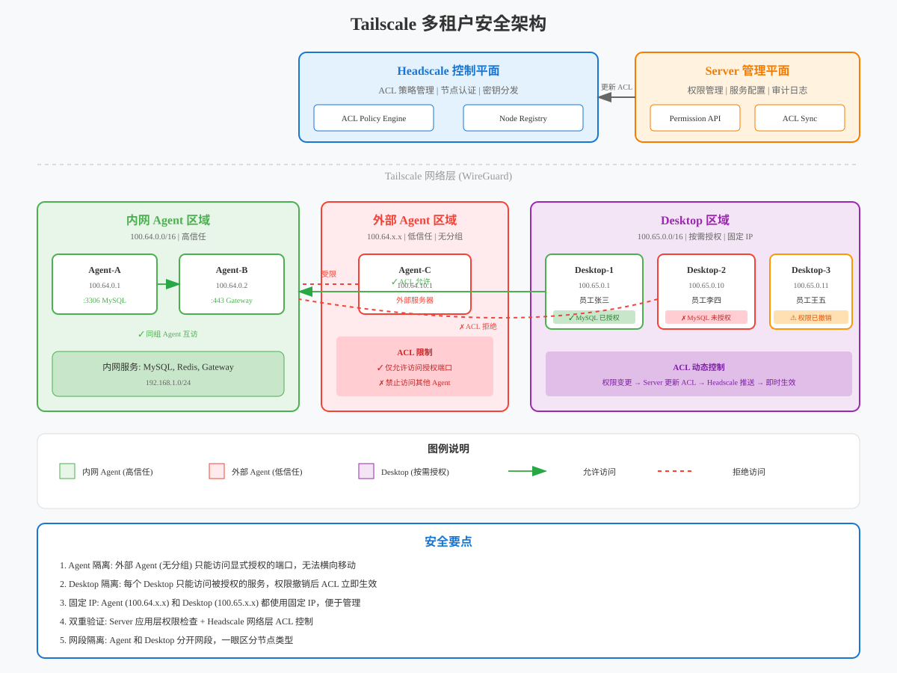
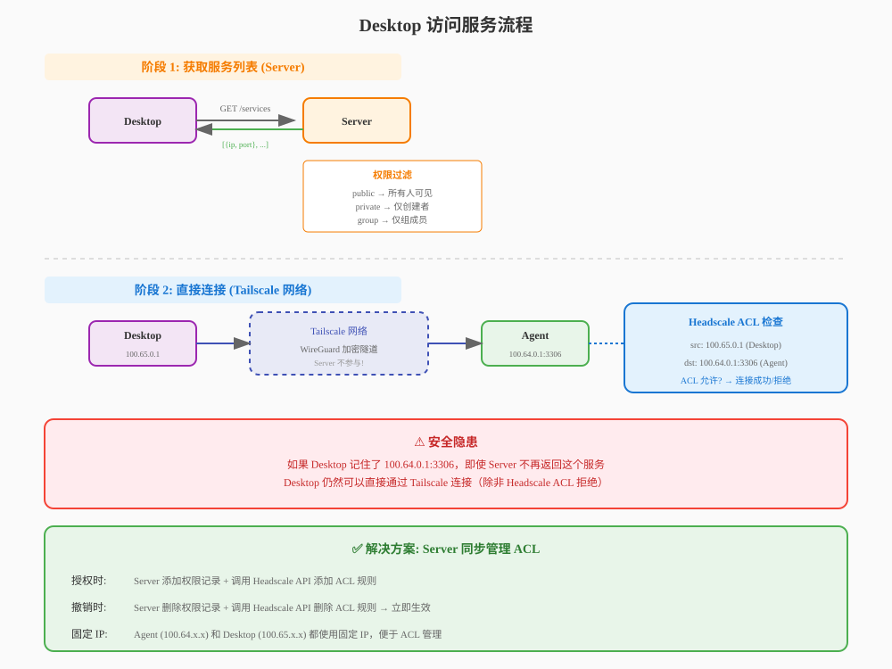

# Tailscale 多租户安全与权限设计

## 1. 问题分析

### 1.1 当前架构的安全隐患

当前设计中，所有 Agent 和 Desktop 都注册到同一个 Headscale User 下，形成一个扁平的 Tailscale 网络：

```
┌─────────────────────────────────────────────────────────────────────────────┐
│                     Headscale User: "default"                               │
│                                                                             │
│   ┌─────────────┐  ┌─────────────┐  ┌─────────────┐  ┌─────────────┐       │
│   │ Agent-A     │  │ Agent-B     │  │ Desktop-1   │  │ Desktop-2   │       │
│   │ 100.64.0.1  │  │ 100.64.0.2  │  │ 100.64.0.10 │  │ 100.64.0.11 │       │
│   │ 公司内网    │  │ 外部服务器  │  │ 员工张三    │  │ 员工李四    │       │
│   └──────┬──────┘  └──────┬──────┘  └──────┬──────┘  └──────┬──────┘       │
│          │                │                │                │               │
│          └────────────────┴────────────────┴────────────────┘               │
│                              全互通！                                        │
│                                                                             │
│   ⚠️ 安全问题：                                                              │
│   1. Desktop-2 可以直接访问 Agent-A 的任意端口                               │
│   2. Agent-B (外部服务器) 可以访问 Agent-A (公司内网)                         │
│   3. Server 的权限控制只影响"看到"，不影响"访问"                              │
│                                                                             │
└─────────────────────────────────────────────────────────────────────────────┘
```

### 1.2 核心安全问题

| 问题                | 描述                                          | 风险等级 |
| ------------------- | --------------------------------------------- | -------- |
| **Agent 互访**      | 任意 Agent 可以访问其他 Agent 的 Tailscale IP | 🔴 高危  |
| **Desktop 越权**    | Desktop 知道 IP:Port 后可绕过 Server 权限控制 | 🔴 高危  |
| **外部 Agent 风险** | 外部服务器上的 Agent 可访问公司内网 Agent     | 🔴 高危  |
| **权限撤销无效**    | 取消授权后，Desktop 仍可通过已知 IP 访问      | 🟡 中危  |

### 1.3 攻击场景示例

**场景 1：外部 Agent 入侵内网**

```
攻击者控制了外部服务器上的 Agent-B
    ↓
Agent-B 在同一 Tailscale 网络中
    ↓
Agent-B 可以直接访问 Agent-A (100.64.0.1)
    ↓
通过 Agent-A 的代理端口访问公司内网所有服务
```

**场景 2：Desktop 越权访问**

```
员工李四被取消了访问 MySQL 的权限
    ↓
但李四之前记住了 100.64.0.1:3306
    ↓
李四的 Desktop 仍在 Tailscale 网络中
    ↓
李四可以直接连接 100.64.0.1:3306
```

## 2. 解决方案：Headscale ACL

### 2.1 ACL 策略设计

Headscale 支持 ACL (Access Control List) 来控制节点间的访问权限。

**核心原则**：

1. **默认拒绝**：所有节点间默认不能互访
2. **显式授权**：只有明确授权的访问才被允许
3. **最小权限**：只开放必要的端口

### 2.2 节点分组设计

```json
{
  "groups": {
    "group:agents-internal": ["tag:agent-internal"],
    "group:agents-external": ["tag:agent-external"],
    "group:desktops": ["tag:desktop"],
    "group:servers": ["tag:server"]
  },
  "tagOwners": {
    "tag:agent-internal": ["autogroup:admin"],
    "tag:agent-external": ["autogroup:admin"],
    "tag:desktop": ["autogroup:admin"],
    "tag:server": ["autogroup:admin"]
  }
}
```

**节点标签说明**：

| 标签                 | 描述              | 示例                |
| -------------------- | ----------------- | ------------------- |
| `tag:agent-internal` | 公司内网 Agent    | 公司 K8S 中的 Agent |
| `tag:agent-external` | 外部/互联网 Agent | 云服务器上的 Agent  |
| `tag:desktop`        | Desktop 客户端    | 员工电脑            |
| `tag:server`         | Server 管理节点   | Headscale 同机部署  |

### 2.3 ACL 规则设计

```json
{
  "acls": [
    // 规则 1: Server 可以访问所有节点（管理需要）
    {
      "action": "accept",
      "src": ["group:servers"],
      "dst": ["*:*"]
    },

    // 规则 2: 内网 Agent 之间可以互访（网关暴露场景）
    {
      "action": "accept",
      "src": ["group:agents-internal"],
      "dst": ["group:agents-internal:*"]
    },

    // 规则 3: 外部 Agent 只能访问内网 Agent 的特定端口
    // 这里需要动态生成，基于 Server 的服务配置
    {
      "action": "accept",
      "src": ["group:agents-external"],
      "dst": ["100.64.0.1:443", "100.64.0.1:80"]
    },

    // 规则 4: Desktop 默认不能访问任何 Agent
    // 需要通过 Server 动态授权

    // 规则 5: 所有节点可以访问 DERP 中继
    {
      "action": "accept",
      "src": ["*"],
      "dst": ["autogroup:internet:443"]
    }
  ]
}
```

### 2.4 动态 ACL 管理

Server 需要动态管理 ACL 规则，实现权限的实时生效：

```
┌─────────────────────────────────────────────────────────────────────────────┐
│                          动态 ACL 管理流程                                   │
├─────────────────────────────────────────────────────────────────────────────┤
│                                                                             │
│   管理员在 Web 界面授权                                                      │
│        │                                                                    │
│        ▼                                                                    │
│   ┌─────────────────────────────────────────────────────────────────────┐   │
│   │ Server API: POST /api/v1/admin/permissions                          │   │
│   │                                                                     │   │
│   │ {                                                                   │   │
│   │   "client_id": 123,                                                 │   │
│   │   "service_id": 456,                                                │   │
│   │   "action": "grant"                                                 │   │
│   │ }                                                                   │   │
│   └─────────────────────────────────────────────────────────────────────┘   │
│        │                                                                    │
│        ▼                                                                    │
│   ┌─────────────────────────────────────────────────────────────────────┐   │
│   │ Server 内部处理:                                                     │   │
│   │                                                                     │   │
│   │ 1. 更新数据库权限记录                                                │   │
│   │ 2. 查询 Client 的 Tailscale IP (100.64.0.10)                        │   │
│   │ 3. 查询 Service 的 Agent Tailscale IP + Port (100.64.0.1:3306)      │   │
│   │ 4. 调用 Headscale API 更新 ACL                                       │   │
│   └─────────────────────────────────────────────────────────────────────┘   │
│        │                                                                    │
│        ▼                                                                    │
│   ┌─────────────────────────────────────────────────────────────────────┐   │
│   │ Headscale API: PUT /api/v1/policy                                   │   │
│   │                                                                     │   │
│   │ 新增 ACL 规则:                                                       │   │
│   │ {                                                                   │   │
│   │   "action": "accept",                                               │   │
│   │   "src": ["100.64.0.10"],  // Desktop IP                            │   │
│   │   "dst": ["100.64.0.1:3306"]  // Agent:Port                         │   │
│   │ }                                                                   │   │
│   └─────────────────────────────────────────────────────────────────────┘   │
│        │                                                                    │
│        ▼                                                                    │
│   Headscale 推送新 ACL 到所有节点                                           │
│   Desktop 立即生效，可以访问 100.64.0.1:3306                                │
│                                                                             │
└─────────────────────────────────────────────────────────────────────────────┘
```

## 3. 权限模型设计

### 3.1 服务权限类型

| 权限类型  | 描述                | ACL 规则                                            |
| --------- | ------------------- | --------------------------------------------------- |
| `public`  | 所有 Desktop 可访问 | `src: ["group:desktops"], dst: ["agent:port"]`      |
| `private` | 仅创建者可访问      | `src: ["specific-desktop-ip"], dst: ["agent:port"]` |
| `group`   | 指定组可访问        | `src: ["group:dev-team"], dst: ["agent:port"]`      |

### 3.2 数据模型扩展

```go
// ProxyService 端口映射服务（扩展）
type ProxyService struct {
    ID          int64  `json:"id"`
    Name        string `json:"name"`
    AgentID     int64  `json:"agent_id"`
    ListenPort  int    `json:"listen_port"`
    TargetAddr  string `json:"target_addr"`

    // 权限控制
    AccessType  string `json:"access_type"`  // public, private, group
    OwnerID     int64  `json:"owner_id"`     // 创建者 Client ID
    GroupID     int64  `json:"group_id"`     // 所属组 ID (access_type=group 时)
}

// ServicePermission 服务访问权限
type ServicePermission struct {
    ID        int64  `json:"id"`
    ServiceID int64  `json:"service_id"`
    ClientID  int64  `json:"client_id"`
    GrantedBy int64  `json:"granted_by"`   // 授权人
    GrantedAt time.Time `json:"granted_at"`
    ExpiresAt *time.Time `json:"expires_at"` // 可选过期时间
}

// ClientGroup 客户端分组
type ClientGroup struct {
    ID   int64  `json:"id"`
    Name string `json:"name"`
}

// ClientGroupMember 组成员
type ClientGroupMember struct {
    GroupID  int64 `json:"group_id"`
    ClientID int64 `json:"client_id"`
}
```

### 3.3 权限检查流程

```
┌─────────────────────────────────────────────────────────────────────────────┐
│                          Desktop 访问服务流程                                │
├─────────────────────────────────────────────────────────────────────────────┤
│                                                                             │
│   ┌─────────────────────────────────────────────────────────────────────┐   │
│   │ 阶段 1: 获取服务列表 (Server 应用层)                                  │   │
│   │                                                                     │   │
│   │   Desktop ──GET /api/v1/client/services──► Server                   │   │
│   │                                                                     │   │
│   │   Server 根据权限过滤:                                               │   │
│   │   - public 服务: 所有人可见                                          │   │
│   │   - private 服务: 仅创建者可见                                       │   │
│   │   - group 服务: 仅组成员可见                                         │   │
│   │                                                                     │   │
│   │   返回: [{name, agent_tailscale_ip, port}, ...]                     │   │
│   └─────────────────────────────────────────────────────────────────────┘   │
│        │                                                                    │
│        │ Desktop 拿到服务列表和连接信息                                      │
│        ▼                                                                    │
│   ┌─────────────────────────────────────────────────────────────────────┐   │
│   │ 阶段 2: 直接连接 (Tailscale 网络层)                                   │   │
│   │                                                                     │   │
│   │   Desktop ──Tailscale 网络──► Agent (100.64.0.1:3306)               │   │
│   │                                                                     │   │
│   │   ⚠️ 此时 Server 不参与！                                            │   │
│   │   Desktop 直接通过 Tailscale 连接 Agent                              │   │
│   │                                                                     │   │
│   │   Headscale ACL 在网络层检查:                                        │   │
│   │   - src: Desktop IP (100.64.0.10)                                   │   │
│   │   - dst: Agent IP:Port (100.64.0.1:3306)                            │   │
│   │   - 如果 ACL 允许 → 连接成功                                         │   │
│   │   - 如果 ACL 拒绝 → 连接被拦截                                       │   │
│   └─────────────────────────────────────────────────────────────────────┘   │
│                                                                             │
│   ⚠️ 安全隐患:                                                              │
│   如果 Desktop 记住了 100.64.0.1:3306，即使 Server 不再返回这个服务，        │
│   Desktop 仍然可以直接连接（除非 Headscale ACL 拒绝）                        │
│                                                                             │
└─────────────────────────────────────────────────────────────────────────────┘
```

**关键点**：Server 只控制"能看到什么"，Headscale ACL 控制"能连接什么"。

两者必须配合：

1. **授权时**：Server 添加权限记录 + 调用 Headscale API 添加 ACL 规则
2. **撤销时**：Server 删除权限记录 + 调用 Headscale API 删除 ACL 规则

## 4. Agent 安全隔离

### 4.1 Agent IP 管理

#### 4.1.1 固定 IP 分配

Agent 需要固定 IP，确保服务地址稳定：

| 时机           | 行为          | 说明                                                 |
| -------------- | ------------- | ---------------------------------------------------- |
| Agent 创建     | 分配固定 IP   | 在 Server Web 界面创建 Agent 时，预分配 Tailscale IP |
| Agent 首次连接 | 使用预分配 IP | Agent 注册时，Server 返回预分配的 IP                 |
| Agent 断线重连 | 保持原 IP     | 即使断线数天，重连后 IP 不变                         |
| Agent 删除     | 回收 IP       | 只有删除 Agent 时才释放 IP                           |

**实现方式**：

```go
// Agent 模型扩展
type Agent struct {
    ID              int64  `json:"id"`
    Name            string `json:"name"`
    TailscaleIP     string `json:"tailscale_ip"`      // 预分配的固定 IP
    TailscaleNodeID string `json:"tailscale_node_id"` // Headscale 节点 ID
    GroupID         int64  `json:"group_id"`          // 所属分组
    // ...
}

// 创建 Agent 时预分配 IP
func (s *AgentService) CreateAgent(name string) (*Agent, error) {
    // 1. 从 IP 池分配一个 IP (100.64.0.x 段)
    ip := s.allocateAgentIP()

    // 2. 创建 Agent 记录
    agent := &Agent{
        Name:        name,
        TailscaleIP: ip,
    }

    // 3. 在 Headscale 预注册节点（可选）
    // 或者等 Agent 首次连接时再注册

    return agent, nil
}
```

**IP 分配策略**：

```
Agent IP 池: 100.64.0.0/24 (100.64.0.1 - 100.64.0.254)
├── 100.64.0.1   - Agent-公司内网-K8S
├── 100.64.0.2   - Agent-公司内网-NAS
├── 100.64.0.3   - Agent-互联网-云服务器
├── ...
└── 100.64.0.254 - 保留
```

#### 4.1.2 Agent 分组

Agent 分组用于控制 Agent 之间的互访权限：

```
┌─────────────────────────────────────────────────────────────────────────────┐
│                          Agent 分组模型                                      │
├─────────────────────────────────────────────────────────────────────────────┤
│                                                                             │
│   ┌─────────────────────────────────────────────────────────────────────┐   │
│   │ 分组: company-internal (公司内网)                                    │   │
│   │                                                                     │   │
│   │   ┌──────────┐  ┌──────────┐  ┌──────────┐                         │   │
│   │   │ Agent-A  │  │ Agent-B  │  │ Agent-C  │                         │   │
│   │   │ K8S      │  │ NAS      │  │ 办公网络 │                         │   │
│   │   │100.64.0.1│  │100.64.0.2│  │100.64.0.3│                         │   │
│   │   └────┬─────┘  └────┬─────┘  └────┬─────┘                         │   │
│   │        │             │             │                               │   │
│   │        └─────────────┴─────────────┘                               │   │
│   │              ✅ 组内互访                                            │   │
│   └─────────────────────────────────────────────────────────────────────┘   │
│                                                                             │
│   ┌─────────────────────────────────────────────────────────────────────┐   │
│   │ 分组: external (外部服务器) - 或无分组                               │   │
│   │                                                                     │   │
│   │   ┌──────────┐                                                     │   │
│   │   │ Agent-D  │  ← 无分组，只能访问显式授权的端口                     │   │
│   │   │ 云服务器 │                                                     │   │
│   │   │100.64.0.10│                                                    │   │
│   │   └──────────┘                                                     │   │
│   │                                                                     │   │
│   │   ❌ 不能访问 company-internal 组的 Agent                           │   │
│   │   ✅ 只能访问被授权的特定端口                                        │   │
│   └─────────────────────────────────────────────────────────────────────┘   │
│                                                                             │
└─────────────────────────────────────────────────────────────────────────────┘
```

**分组规则**：

| 场景         | ACL 规则               |
| ------------ | ---------------------- |
| 同组 Agent   | 允许互访所有端口       |
| 无分组 Agent | 只能访问显式授权的端口 |
| 跨组 Agent   | 默认拒绝，需显式授权   |

**数据模型**：

```go
// AgentGroup Agent 分组
type AgentGroup struct {
    ID          int64  `json:"id"`
    Name        string `json:"name"`        // 分组名称
    Description string `json:"description"` // 描述
    AllowInternalAccess bool `json:"allow_internal_access"` // 组内是否互访
}

// Agent 模型
type Agent struct {
    // ...
    GroupID *int64 `json:"group_id"` // 所属分组，nil 表示无分组
}
```

**ACL 生成逻辑**：

```go
func generateAgentACL(agents []Agent, groups []AgentGroup) []ACLRule {
    var rules []ACLRule

    // 1. 同组 Agent 互访规则
    for _, group := range groups {
        if !group.AllowInternalAccess {
            continue
        }
        groupAgents := getAgentsByGroup(agents, group.ID)
        for _, src := range groupAgents {
            for _, dst := range groupAgents {
                if src.ID != dst.ID {
                    rules = append(rules, ACLRule{
                        Src: src.TailscaleIP,
                        Dst: dst.TailscaleIP + ":*",
                    })
                }
            }
        }
    }

    // 2. 无分组 Agent 默认拒绝（不生成规则）

    return rules
}
```

### 4.2 Agent 分类

| 类型       | 标签                 | 信任级别 | 可访问范围              |
| ---------- | -------------------- | -------- | ----------------------- |
| 内网 Agent | `tag:agent-internal` | 高       | 内网 Agent 互访         |
| 外部 Agent | `tag:agent-external` | 低       | 仅授权的内网 Agent 端口 |
| 网关 Agent | `tag:agent-gateway`  | 中       | 特定内网 Agent 端口     |

### 4.2 Agent 注册时的标签分配

```go
// Agent 注册时，Server 根据来源分配标签
func (s *AgentService) Register(ctx context.Context, req *pb.RegisterRequest) {
    // 获取 Agent 来源 IP
    sourceIP := getSourceIP(ctx)

    // 判断是否为内网 IP
    isInternal := isInternalIP(sourceIP)

    // 分配标签
    var tags []string
    if isInternal {
        tags = []string{"tag:agent-internal"}
    } else {
        tags = []string{"tag:agent-external"}
    }

    // 创建 PreAuthKey 时指定标签
    authKey, err := headscaleClient.CreatePreAuthKey(ctx, user, expiry, false, tags)
}
```

### 4.3 外部 Agent 的限制

```
┌─────────────────────────────────────────────────────────────────────────────┐
│                        外部 Agent 安全限制                                   │
├─────────────────────────────────────────────────────────────────────────────┤
│                                                                             │
│   外部 Agent (tag:agent-external)                                           │
│   100.64.0.100                                                              │
│        │                                                                    │
│        │ 尝试访问内网 Agent                                                  │
│        ▼                                                                    │
│   ┌─────────────────────────────────────────────────────────────────────┐   │
│   │ Headscale ACL 检查                                                   │   │
│   │                                                                     │   │
│   │ 规则: 外部 Agent 只能访问显式授权的端口                               │   │
│   │                                                                     │   │
│   │ ✅ 允许: 100.64.0.100 → 100.64.0.1:443 (已授权的网关端口)            │   │
│   │ ❌ 拒绝: 100.64.0.100 → 100.64.0.1:3306 (未授权)                     │   │
│   │ ❌ 拒绝: 100.64.0.100 → 100.64.0.2:* (未授权的 Agent)                │   │
│   └─────────────────────────────────────────────────────────────────────┘   │
│                                                                             │
│   即使攻击者控制了外部 Agent，也只能访问已授权的特定端口                      │
│                                                                             │
└─────────────────────────────────────────────────────────────────────────────┘
```

## 5. Desktop 安全隔离

### 5.1 Desktop 多实例支持

员工可能在多个设备上使用 Desktop（公司电脑、家里电脑、笔记本等）：

```
┌─────────────────────────────────────────────────────────────────────────────┐
│                          Desktop 多实例模型                                  │
├─────────────────────────────────────────────────────────────────────────────┤
│                                                                             │
│   员工: 张三 (Client ID: 123)                                               │
│                                                                             │
│   ┌─────────────────┐  ┌─────────────────┐  ┌─────────────────┐            │
│   │ Desktop 实例 1  │  │ Desktop 实例 2  │  │ Desktop 实例 3  │            │
│   │ 公司电脑        │  │ 家里电脑        │  │ 笔记本          │            │
│   │                 │  │                 │  │                 │            │
│   │ 100.64.1.10     │  │ 100.64.1.11     │  │ 100.64.1.12     │            │
│   │ (固定 IP)       │  │ (固定 IP)       │  │ (固定 IP)       │            │
│   │                 │  │                 │  │                 │            │
│   │ 设备指纹: abc   │  │ 设备指纹: def   │  │ 设备指纹: ghi   │            │
│   └─────────────────┘  └─────────────────┘  └─────────────────┘            │
│                                                                             │
│   每个实例有独立的:                                                          │
│   - Tailscale IP (固定)                                                     │
│   - 设备指纹                                                                │
│   - 在线状态                                                                │
│   - 暴露的服务 (如 RDP 3389)                                                │
│                                                                             │
└─────────────────────────────────────────────────────────────────────────────┘
```

**数据模型**：

```go
// DesktopInstance Desktop 实例
type DesktopInstance struct {
    ID              int64     `json:"id"`
    ClientID        int64     `json:"client_id"`         // 所属 Client
    DeviceToken     string    `json:"device_token"`      // 设备 Token
    DeviceFingerprint string  `json:"device_fingerprint"` // 设备指纹
    DeviceName      string    `json:"device_name"`       // 设备名称
    TailscaleIP     string    `json:"tailscale_ip"`      // 固定 Tailscale IP
    TailscaleNodeID string    `json:"tailscale_node_id"` // Headscale 节点 ID
    Online          bool      `json:"online"`            // 在线状态
    LastSeenAt      time.Time `json:"last_seen_at"`      // 最后在线时间
    CreatedAt       time.Time `json:"created_at"`
}

// DesktopService Desktop 暴露的服务
type DesktopService struct {
    ID                int64  `json:"id"`
    DesktopInstanceID int64  `json:"desktop_instance_id"`
    Name              string `json:"name"`        // 服务名称
    Port              int    `json:"port"`        // 监听端口
    Protocol          string `json:"protocol"`    // tcp/udp
    Description       string `json:"description"` // 描述
}
```

### 5.2 Desktop 固定 IP

Desktop 也需要固定 IP，支持以下场景：

| 场景     | 需求                                   |
| -------- | -------------------------------------- |
| 远程桌面 | 员工从公司访问家里电脑的 RDP (3389)    |
| 文件共享 | 访问家里电脑的 SMB 共享 (445)          |
| 开发调试 | 访问家里电脑的开发服务 (8080, 3000 等) |
| 数据库   | 访问家里电脑的本地数据库 (3306, 5432)  |

**IP 分配策略**：

```
Desktop IP 池: 100.64.1.0/24 (100.64.1.1 - 100.64.1.254)
├── 100.64.1.1   - 张三-公司电脑
├── 100.64.1.2   - 张三-家里电脑
├── 100.64.1.3   - 张三-笔记本
├── 100.64.1.10  - 李四-公司电脑
├── 100.64.1.11  - 李四-家里电脑
├── ...
└── 100.64.1.254 - 保留
```

**实现方式**：

```go
// Desktop 首次连接时分配固定 IP
func (s *ClientService) RegisterDesktop(clientID int64, deviceFingerprint string) (*DesktopInstance, error) {
    // 1. 检查是否已有该设备的实例
    existing := s.findByFingerprint(clientID, deviceFingerprint)
    if existing != nil {
        // 已存在，返回原实例（保持 IP 不变）
        return existing, nil
    }

    // 2. 新设备，分配固定 IP
    ip := s.allocateDesktopIP(clientID)

    // 3. 创建实例记录
    instance := &DesktopInstance{
        ClientID:          clientID,
        DeviceFingerprint: deviceFingerprint,
        TailscaleIP:       ip,
    }

    // 4. 创建 Headscale PreAuthKey（非 Ephemeral，保持节点）
    authKey, _ := s.headscale.CreatePreAuthKey(user, expiry, false) // Ephemeral = false

    return instance, nil
}
```

**关键变化**：Desktop 不再使用 Ephemeral 模式，而是持久化节点以保持固定 IP。

### 5.3 网段隔离

Agent 和 Desktop 使用不同网段，实现清晰的隔离：

```
┌─────────────────────────────────────────────────────────────────────────────┐
│                          Tailscale 网段规划                                  │
├─────────────────────────────────────────────────────────────────────────────┤
│                                                                             │
│   Tailscale 总网段: 100.64.0.0/10                                           │
│                                                                             │
│   ┌─────────────────────────────────────────────────────────────────────┐   │
│   │ Agent 网段: 100.64.0.0/24                                           │   │
│   │                                                                     │   │
│   │   100.64.0.1 - 100.64.0.254                                         │   │
│   │   用于: 服务端 Agent (K8S, NAS, 云服务器等)                          │   │
│   │   特点: 提供服务，被 Desktop 访问                                    │   │
│   └─────────────────────────────────────────────────────────────────────┘   │
│                                                                             │
│   ┌─────────────────────────────────────────────────────────────────────┐   │
│   │ Desktop 网段: 100.64.1.0/24                                         │   │
│   │                                                                     │   │
│   │   100.64.1.1 - 100.64.1.254                                         │   │
│   │   用于: 客户端 Desktop (员工电脑)                                    │   │
│   │   特点: 访问 Agent 服务，也可暴露自己的服务                          │   │
│   └─────────────────────────────────────────────────────────────────────┘   │
│                                                                             │
│   ┌─────────────────────────────────────────────────────────────────────┐   │
│   │ Server 网段: 100.64.2.0/24 (可选)                                   │   │
│   │                                                                     │   │
│   │   100.64.2.1 - 100.64.2.254                                         │   │
│   │   用于: 管理节点 (Headscale, Server 等)                              │   │
│   └─────────────────────────────────────────────────────────────────────┘   │
│                                                                             │
│   网段隔离优势:                                                              │
│   ✅ 一眼区分节点类型 (0.x = Agent, 1.x = Desktop)                          │
│   ✅ ACL 规则更简洁 (可按网段批量授权)                                       │
│   ✅ 安全审计更清晰                                                         │
│   ✅ IP 管理更方便                                                          │
│                                                                             │
└─────────────────────────────────────────────────────────────────────────────┘
```

**ACL 规则示例**：

```json
{
  "acls": [
    // Desktop 访问 Agent (需要显式授权)
    {
      "action": "accept",
      "src": ["100.64.1.10"], // 张三的 Desktop
      "dst": ["100.64.0.1:3306"] // Agent-A 的 MySQL
    },

    // Desktop 之间互访 (员工访问自己的其他设备)
    {
      "action": "accept",
      "src": ["100.64.1.1"], // 张三-公司电脑
      "dst": ["100.64.1.2:3389"] // 张三-家里电脑的 RDP
    },

    // 同组 Agent 互访
    {
      "action": "accept",
      "src": ["100.64.0.0/24"], // 所有 Agent
      "dst": ["100.64.0.0/24:*"], // 所有 Agent 的所有端口
      "proto": "",
      "comment": "Agent 组内互访"
    }
  ]
}
```

### 5.4 Desktop 服务暴露

员工可以将自己 Desktop 上的服务暴露给其他设备访问：

```
┌─────────────────────────────────────────────────────────────────────────────┐
│                          Desktop 服务暴露场景                                │
├─────────────────────────────────────────────────────────────────────────────┤
│                                                                             │
│   场景: 张三在公司访问家里电脑的远程桌面                                      │
│                                                                             │
│   ┌─────────────────┐                      ┌─────────────────┐              │
│   │ 张三-公司电脑   │                      │ 张三-家里电脑   │              │
│   │ 100.64.1.1      │                      │ 100.64.1.2      │              │
│   │                 │                      │                 │              │
│   │ Desktop Client  │ ──── Tailscale ────► │ Desktop Client  │              │
│   │                 │      网络            │                 │              │
│   │ mstsc 连接      │                      │ 暴露 RDP 3389   │              │
│   │ 100.64.1.2:3389 │                      │                 │              │
│   └─────────────────┘                      └─────────────────┘              │
│                                                                             │
│   配置步骤:                                                                  │
│   1. 家里电脑 Desktop 配置暴露 RDP 服务 (端口 3389)                          │
│   2. Server 自动添加 ACL 规则允许张三的其他设备访问                          │
│   3. 公司电脑使用 mstsc 连接 100.64.1.2:3389                                │
│                                                                             │
└─────────────────────────────────────────────────────────────────────────────┘
```

**Desktop 服务暴露 API**：

```go
// POST /api/v1/client/desktop/services
type ExposeServiceRequest struct {
    Port        int    `json:"port"`        // 要暴露的端口
    Protocol    string `json:"protocol"`    // tcp/udp
    Name        string `json:"name"`        // 服务名称
    Description string `json:"description"` // 描述
    AllowSelf   bool   `json:"allow_self"`  // 是否允许自己的其他设备访问
    AllowAll    bool   `json:"allow_all"`   // 是否允许所有人访问 (需要管理员审批)
}
```

### 5.5 权限撤销的即时生效

```
┌─────────────────────────────────────────────────────────────────────────────┐
│                        权限撤销流程                                          │
├─────────────────────────────────────────────────────────────────────────────┤
│                                                                             │
│   管理员撤销 Desktop-A 对 MySQL 的访问权限                                   │
│        │                                                                    │
│        ▼                                                                    │
│   ┌─────────────────────────────────────────────────────────────────────┐   │
│   │ 1. Server 更新数据库                                                 │   │
│   │    DELETE FROM service_permissions                                  │   │
│   │    WHERE client_id = 123 AND service_id = 456                       │   │
│   └─────────────────────────────────────────────────────────────────────┘   │
│        │                                                                    │
│        ▼                                                                    │
│   ┌─────────────────────────────────────────────────────────────────────┐   │
│   │ 2. Server 更新 Headscale ACL                                         │   │
│   │                                                                     │   │
│   │    删除 ACL 规则:                                                    │   │
│   │    {                                                                │   │
│   │      "src": ["100.64.0.10"],  // Desktop-A                          │   │
│   │      "dst": ["100.64.0.1:3306"]  // MySQL                           │   │
│   │    }                                                                │   │
│   └─────────────────────────────────────────────────────────────────────┘   │
│        │                                                                    │
│        ▼                                                                    │
│   ┌─────────────────────────────────────────────────────────────────────┐   │
│   │ 3. Headscale 推送新 ACL                                              │   │
│   │                                                                     │   │
│   │    所有节点收到更新后的 ACL                                          │   │
│   │    Desktop-A 的连接被立即断开                                        │   │
│   │    后续连接尝试被 ACL 拒绝                                           │   │
│   └─────────────────────────────────────────────────────────────────────┘   │
│        │                                                                    │
│        ▼                                                                    │
│   Desktop-A 即使知道 100.64.0.1:3306，也无法连接                            │
│   因为 Tailscale 网络层已经拒绝了这个连接                                    │
│                                                                             │
└─────────────────────────────────────────────────────────────────────────────┘
```

### 5.2 Desktop 临时节点

Desktop 使用 `Ephemeral = true` 创建临时节点：

- 断开连接后自动从 Headscale 删除
- 重新连接时获取新的 Tailscale IP
- 防止 IP 被记住后的越权访问

```go
// Desktop 连接时创建临时 PreAuthKey
authKey, err := headscaleClient.CreatePreAuthKey(
    ctx,
    user,
    24*time.Hour,  // 24小时过期
    true,          // Ephemeral = true
)
```

## 6. 安全架构总览

### 6.1 完整安全架构图



### 6.2 权限控制流程图



## 7. 回答你的问题

### 7.1 问题 1：外部 Agent 是否会导致安全问题？

**答案：通过 ACL 可以有效隔离**

| 场景                      | 当前设计 (无 ACL)     | 改进后 (有 ACL)       |
| ------------------------- | --------------------- | --------------------- |
| 外部 Agent 访问内网 Agent | ⚠️ 可以访问任意端口   | ✅ 只能访问授权端口   |
| 外部 Agent 横向移动       | ⚠️ 可以扫描所有 Agent | ✅ ACL 拒绝未授权访问 |
| 攻击者控制外部 Agent      | ⚠️ 可入侵整个网络     | ✅ 影响范围受限       |

**实现方式**：

1. Agent 注册时根据来源 IP 分配标签 (`tag:agent-internal` 或 `tag:agent-external`)
2. ACL 规则限制外部 Agent 只能访问特定端口
3. 内网 Agent 之间可以互访（用于网关暴露等场景）

### 7.2 问题 2：Desktop 权限是否隔离？

**答案：需要 ACL 配合才能真正隔离**

| 场景               | 当前设计 (无 ACL)        | 改进后 (有 ACL)         |
| ------------------ | ------------------------ | ----------------------- |
| 权限撤销后访问     | ⚠️ 知道 IP:Port 仍可访问 | ✅ ACL 立即拒绝         |
| 越权访问未授权服务 | ⚠️ 可以尝试连接          | ✅ ACL 拒绝             |
| IP 被记住          | ⚠️ 可持续访问            | ✅ Ephemeral 节点 + ACL |

**实现方式**：

1. Desktop 使用固定 IP，每个设备独立 IP
2. 每次授权时动态添加 ACL 规则
3. 撤销权限时同步删除 ACL 规则
4. Headscale 推送新 ACL，立即生效

## 8. 网段规划总结

### 8.1 IP 分配策略

```
Tailscale 总网段: 100.64.0.0/10 (可用: 100.64.0.0 - 100.127.255.255)

┌─────────────────────────────────────────────────────────────────┐
│ Agent 网段: 100.64.0.0/16                                       │
│ 可用 IP: 100.64.0.1 - 100.64.255.254 (65534 个)                 │
│                                                                 │
│   100.64.0.1   - Agent-公司内网-K8S-主集群                       │
│   100.64.0.2   - Agent-公司内网-K8S-测试集群                     │
│   100.64.0.3   - Agent-公司内网-NAS                             │
│   100.64.0.4   - Agent-公司内网-办公网络                         │
│   ...                                                           │
│   100.64.1.1   - Agent-分公司A-K8S                              │
│   100.64.1.2   - Agent-分公司A-NAS                              │
│   ...                                                           │
│   100.64.10.1  - Agent-外部-云服务器-阿里云                      │
│   100.64.10.2  - Agent-外部-云服务器-腾讯云                      │
│   ...                                                           │
│                                                                 │
│   特点: 固定 IP，创建时分配，断线不回收                          │
│   容量: 65534 个 Agent，足够大规模部署                           │
└─────────────────────────────────────────────────────────────────┘

┌─────────────────────────────────────────────────────────────────┐
│ Desktop 网段: 100.65.0.0/16                                     │
│ 可用 IP: 100.65.0.1 - 100.65.255.254 (65534 个)                 │
│                                                                 │
│   100.65.0.1   - 张三-公司电脑                                  │
│   100.65.0.2   - 张三-家里电脑                                  │
│   100.65.0.3   - 张三-笔记本                                    │
│   ...                                                           │
│   100.65.1.1   - 李四-公司电脑                                  │
│   100.65.1.2   - 李四-家里电脑                                  │
│   ...                                                           │
│   100.65.100.1 - 王五-公司电脑                                  │
│   ...                                                           │
│                                                                 │
│   特点: 固定 IP，多实例支持，可暴露服务                          │
│   容量: 65534 个 Desktop 实例                                   │
└─────────────────────────────────────────────────────────────────┘

┌─────────────────────────────────────────────────────────────────┐
│ Server 网段: 100.66.0.0/16 (可选，预留)                         │
│ 可用 IP: 100.66.0.1 - 100.66.255.254                            │
│                                                                 │
│   100.66.0.1   - Headscale                                      │
│   100.66.0.2   - Server                                         │
│   ...                                                           │
│                                                                 │
│   特点: 管理节点，可访问所有网段                                 │
└─────────────────────────────────────────────────────────────────┘

网段一览:
┌──────────────────┬─────────────────────┬──────────┐
│ 网段             │ 用途                │ 容量     │
├──────────────────┼─────────────────────┼──────────┤
│ 100.64.0.0/16    │ Agent (服务端)      │ 65534    │
│ 100.65.0.0/16    │ Desktop (客户端)    │ 65534    │
│ 100.66.0.0/16    │ Server (管理端)     │ 65534    │
│ 100.67-127.x.x   │ 预留扩展            │ -        │
└──────────────────┴─────────────────────┴──────────┘
```

### 8.2 关键设计决策

| 决策            | 说明                   | 原因                    |
| --------------- | ---------------------- | ----------------------- |
| Agent 固定 IP   | 创建时分配，断线不回收 | 服务地址稳定，便于配置  |
| Agent 分组      | 同组互访，跨组需授权   | 防止外部 Agent 横向移动 |
| Desktop 固定 IP | 每设备独立 IP          | 支持服务暴露（RDP 等）  |
| Desktop 多实例  | 同一员工多设备         | 公司/家里/笔记本        |
| 网段隔离        | 0.x=Agent, 1.x=Desktop | 清晰区分，便于 ACL      |
| 非 Ephemeral    | Desktop 不再临时节点   | 保持固定 IP             |

## 9. 实施建议

### 9.1 短期方案（推荐）

1. **启用 Headscale ACL**

   - 配置默认拒绝策略
   - Server 动态管理 ACL 规则

2. **Agent 分组管理**

   - 创建 Agent 时分配固定 IP
   - 支持分组，同组互访
   - 无分组 Agent 只能访问授权端口

3. **Desktop 固定 IP**
   - 首次连接时分配固定 IP
   - 基于设备指纹识别实例
   - 支持服务暴露

### 9.2 长期方案

1. **多 User 隔离**

   - 不同租户使用不同 Headscale User
   - 完全网络隔离

2. **细粒度 ACL**

   - 基于时间的访问控制
   - 基于 IP 范围的访问控制

3. **零信任架构**
   - 每次访问都需要认证
   - 持续验证身份

## 10. 总结

| 问题            | 解决方案              | 复杂度 |
| --------------- | --------------------- | ------ |
| Agent 互访      | 分组管理 + ACL        | 中     |
| Desktop 越权    | 动态 ACL + 固定 IP    | 中     |
| 权限撤销无效    | ACL 同步删除          | 低     |
| 外部 Agent 风险 | 无分组隔离 + 端口限制 | 中     |
| Desktop 多实例  | 设备指纹 + 固定 IP    | 中     |
| 网段混乱        | 0.x/1.x 网段隔离      | 低     |

**核心原则**：

- Server 应用层权限 + Headscale 网络层 ACL = 双重保障
- Agent (100.64.x.x) 和 Desktop (100.65.x.x) 网段隔离，一眼区分
- 固定 IP 保证服务地址稳定
- 分组管理防止横向移动
