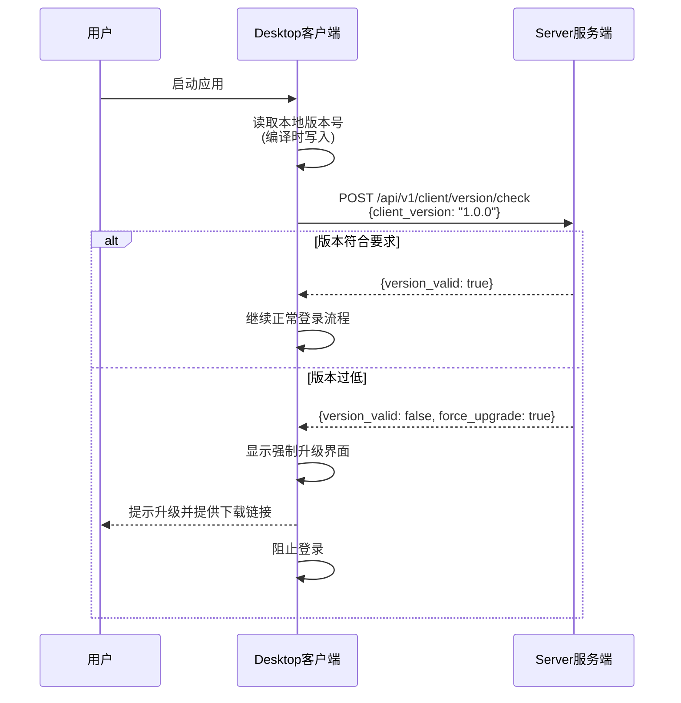

# Desktop版本管理设计文档

## 1. 概述

本文档描述Desktop客户端的版本管理机制，确保客户端版本符合服务端要求，提升系统安全性和稳定性。

**相关文档**：
- 详细的API设计请参考 [API设计文档](./design_api.md) 的 `2.9 版本管理API`
- 详细的数据库设计请参考 [数据库设计文档](./design_database.md) 的 `2.10 系统设置表`

## 2. 需求背景

### 2.1 问题描述

在系统发布后，可能会出现以下情况：
- 旧版本Desktop存在安全漏洞
- 旧版本Desktop与新版Server API不兼容
- 需要强制用户升级到新版本

### 2.2 解决方案

**Server端**：
- 设置最低支持的Desktop版本号
- 管理员可以在Web界面修改最低版本要求

**Desktop端**：
- 每次登录时上报自己的版本号
- 如果版本低于Server要求的最低版本，强制升级
- 显示升级提示和下载链接

## 3. 版本号规范

### 3.1 版本号格式

使用语义化版本号（Semantic Versioning）：

```
MAJOR.MINOR.PATCH

例如：1.0.0, 1.2.3, 2.0.0
```

**版本号说明**：
- **MAJOR**（主版本号）：不兼容的API变更
- **MINOR**（次版本号）：向后兼容的功能新增
- **PATCH**（修订号）：向后兼容的问题修正

### 3.2 版本比较规则

```go
// 版本比较示例
1.0.0 < 1.0.1 < 1.1.0 < 2.0.0

// 比较逻辑
func CompareVersion(v1, v2 string) int {
    // 返回值：
    // -1: v1 < v2
    //  0: v1 == v2
    //  1: v1 > v2
}
```

## 4. 数据库设计

### 4.1 新增表

**system_settings** - 系统设置表

存储系统级别的配置项，包括Desktop版本管理相关设置。

详细的表结构设计请参考 [数据库设计文档](./design_database.md) 的 `2.10 系统设置表`。

### 4.2 预定义设置项

| setting_key | 默认值 | 说明 |
|-------------|--------|------|
| `desktop_min_version` | `1.0.0` | Desktop最低支持版本 |
| `desktop_latest_version` | `1.0.0` | Desktop最新版本（可选） |
| `desktop_download_url` | `https://...` | Desktop下载地址 |
| `version_check_enabled` | `true` | 是否启用版本检查 |

## 5. API设计

详细的API设计请参考 [API设计文档](./design_api.md) 的 `2.9 版本管理API`。

### 5.1 Desktop版本检查API

- `POST /api/v1/client/version/check` - Desktop检查版本是否符合要求

### 5.2 管理员版本管理API

- `GET /api/v1/admin/settings/version` - 获取版本设置
- `PUT /api/v1/admin/settings/version/min` - 更新最低版本要求
- `PUT /api/v1/admin/settings/version/download-url` - 更新下载地址
- `PUT /api/v1/admin/settings/version/check-enabled` - 启用/禁用版本检查

## 6. Desktop客户端实现

### 6.1 版本检查流程



### 6.2 版本号获取

**编译时注入版本号**：

```go
// desktop/internal/version/version.go
package version

var (
    // 这些变量在编译时通过 -ldflags 注入
    Version   = "dev"
    GitCommit = "unknown"
    BuildTime = "unknown"
)

func GetVersion() string {
    return Version
}

func GetFullVersion() string {
    return fmt.Sprintf("%s (commit: %s, built: %s)", Version, GitCommit, BuildTime)
}
```

**编译脚本**：

```bash
#!/bin/bash
# scripts/build_desktop.sh

VERSION="1.0.0"
GIT_COMMIT=$(git rev-parse --short HEAD)
BUILD_TIME=$(date -u '+%Y-%m-%d_%H:%M:%S')

go build -ldflags "\
  -X 'github.com/your-org/awecloud-desktop/internal/version.Version=${VERSION}' \
  -X 'github.com/your-org/awecloud-desktop/internal/version.GitCommit=${GIT_COMMIT}' \
  -X 'github.com/your-org/awecloud-desktop/internal/version.BuildTime=${BUILD_TIME}'" \
  -o bin/desktop cmd/desktop/main.go
```

### 6.3 强制升级界面

```
┌─────────────────────────────────────────────┐
│  AWECloud Desktop - 需要升级                │
├─────────────────────────────────────────────┤
│                                             │
│  ⚠️ 您的版本过低，需要升级                   │
│                                             │
│  当前版本: 1.0.0                            │
│  最低要求: 1.1.0                            │
│  最新版本: 1.2.0                            │
│                                             │
│  为了您的安全和更好的体验，                  │
│  请升级到最新版本。                          │
│                                             │
│  [立即下载]  [稍后提醒]                      │
│                                             │
└─────────────────────────────────────────────┘
```

**注意**：
- 如果`force_upgrade: true`，则只显示"立即下载"按钮
- 点击"立即下载"打开浏览器访问下载链接
- 强制升级时，阻止用户继续使用应用

### 6.4 版本检查代码示例

```go
// desktop/internal/client/version_check.go
package client

import (
    "fmt"
    "github.com/your-org/awecloud-desktop/internal/version"
)

type VersionCheckResponse struct {
    Success            bool   `json:"success"`
    VersionValid       bool   `json:"version_valid"`
    MinVersion         string `json:"min_version"`
    LatestVersion      string `json:"latest_version"`
    CurrentVersion     string `json:"current_version"`
    DownloadURL        string `json:"download_url"`
    Message            string `json:"message"`
    ForceUpgrade       bool   `json:"force_upgrade"`
    VersionCheckEnabled bool  `json:"version_check_enabled"`
}

func CheckVersion(serverURL string) (*VersionCheckResponse, error) {
    req := map[string]string{
        "client_version": version.GetVersion(),
        "os":            runtime.GOOS,
        "arch":          runtime.GOARCH,
    }
    
    resp := &VersionCheckResponse{}
    err := httpPost(serverURL+"/api/v1/client/version/check", req, resp)
    if err != nil {
        return nil, err
    }
    
    return resp, nil
}

func (c *Client) ValidateVersion() error {
    resp, err := CheckVersion(c.serverURL)
    if err != nil {
        return fmt.Errorf("version check failed: %w", err)
    }
    
    if !resp.VersionValid && resp.ForceUpgrade {
        // 显示强制升级界面
        ShowUpgradeDialog(resp)
        return fmt.Errorf("version too old, upgrade required")
    }
    
    return nil
}
```

## 7. Web管理界面设计

### 7.1 版本管理页面

**路由**：`/admin/settings/version`

**界面布局**：

```
┌─────────────────────────────────────────────────────┐
│  系统设置 > 版本管理                                 │
├─────────────────────────────────────────────────────┤
│                                                     │
│  Desktop客户端版本管理                               │
│                                                     │
│  ┌─────────────────────────────────────────────┐   │
│  │ 启用版本检查                                  │   │
│  │ ☑ 启用（取消勾选将允许所有版本登录）           │   │
│  └─────────────────────────────────────────────┘   │
│                                                     │
│  ┌─────────────────────────────────────────────┐   │
│  │ 最低支持版本                                  │   │
│  │ [1.0.0                    ] [更新]           │   │
│  │ 低于此版本的客户端将无法登录                   │   │
│  └─────────────────────────────────────────────┘   │
│                                                     │
│  ┌─────────────────────────────────────────────┐   │
│  │ 最新版本（可选）                              │   │
│  │ [1.2.0                    ] [更新]           │   │
│  │ 用于提示用户有新版本可用                       │   │
│  └─────────────────────────────────────────────┘   │
│                                                     │
│  ┌─────────────────────────────────────────────┐   │
│  │ 下载地址                                      │   │
│  │ [https://github.com/...   ] [更新]           │   │
│  │ 用户点击升级时跳转的下载页面                   │   │
│  └─────────────────────────────────────────────┘   │
│                                                     │
│  最后更新: 2025-11-27 10:30:00 by admin            │
│                                                     │
└─────────────────────────────────────────────────────┘
```

### 7.2 Vue组件示例

```vue
<!-- web/src/views/admin/VersionSettings.vue -->
<template>
  <div class="version-settings">
    <el-card>
      <template #header>
        <span>Desktop客户端版本管理</span>
      </template>
      
      <el-form :model="form" label-width="150px">
        <el-form-item label="启用版本检查">
          <el-switch v-model="form.enabled" @change="updateEnabled" />
          <div class="form-tip">取消勾选将允许所有版本登录</div>
        </el-form-item>
        
        <el-form-item label="最低支持版本">
          <el-input v-model="form.minVersion" style="width: 200px" />
          <el-button type="primary" @click="updateMinVersion">更新</el-button>
          <div class="form-tip">低于此版本的客户端将无法登录</div>
        </el-form-item>
        
        <el-form-item label="最新版本">
          <el-input v-model="form.latestVersion" style="width: 200px" />
          <el-button type="primary" @click="updateLatestVersion">更新</el-button>
          <div class="form-tip">用于提示用户有新版本可用</div>
        </el-form-item>
        
        <el-form-item label="下载地址">
          <el-input v-model="form.downloadUrl" style="width: 400px" />
          <el-button type="primary" @click="updateDownloadUrl">更新</el-button>
          <div class="form-tip">用户点击升级时跳转的下载页面</div>
        </el-form-item>
      </el-form>
      
      <div class="update-info">
        最后更新: {{ form.updatedAt }} by {{ form.updatedBy }}
      </div>
    </el-card>
  </div>
</template>
```

## 8. 实施计划

### 8.1 第一阶段：数据库和API

1. 创建`system_settings`表
2. 实现版本检查API
3. 实现管理员版本管理API
4. 添加单元测试

### 8.2 第二阶段：Desktop客户端

1. 实现版本号注入机制
2. 实现版本检查逻辑
3. 实现强制升级界面
4. 集成到登录流程

### 8.3 第三阶段：Web管理界面

1. 实现版本管理页面
2. 添加到系统设置菜单
3. 测试版本管理功能

### 8.4 第四阶段：测试和发布

1. 端到端测试
2. 文档更新
3. 发布第一个正式版本（1.0.0）

## 9. 版本发布流程

### 9.1 发布新版本

1. **更新版本号**：
   ```bash
   # 修改 VERSION 文件
   echo "1.1.0" > VERSION
   ```

2. **构建新版本**：
   ```bash
   ./scripts/build_desktop.sh
   ```

3. **创建Git标签**：
   ```bash
   git tag -a v1.1.0 -m "Release version 1.1.0"
   git push origin v1.1.0
   ```

4. **上传到GitHub Releases**：
   - 创建新的Release
   - 上传编译好的二进制文件
   - 编写Release Notes

5. **更新Server设置**（如果需要强制升级）：
   - 登录Web管理界面
   - 进入"系统设置 > 版本管理"
   - 更新最低支持版本

### 9.2 版本号递增规则

- **修复Bug**：递增PATCH版本（1.0.0 → 1.0.1）
- **新增功能**：递增MINOR版本（1.0.1 → 1.1.0）
- **重大变更**：递增MAJOR版本（1.1.0 → 2.0.0）

## 10. 安全考虑

### 10.1 版本检查绕过防护

- 版本检查在Server端进行，Desktop无法绕过
- 即使Desktop伪造版本号，Server也会在后续API调用中验证
- 建议在JWT Token中包含Desktop版本号

### 10.2 下载链接安全

- 使用HTTPS下载链接
- 建议使用官方GitHub Releases或可信CDN
- 提供文件校验和（SHA256）

### 10.3 版本回退

- 管理员可以降低最低版本要求
- 但不建议频繁修改，避免用户困惑

## 11. 监控和告警

### 11.1 关键指标

- 版本检查失败次数
- 被拒绝的旧版本客户端数量
- 各版本客户端的分布情况

### 11.2 告警规则

- 大量客户端版本检查失败
- 最低版本设置被频繁修改

## 12. 总结

版本管理机制确保了：
- ✅ Desktop客户端版本可控
- ✅ 可以强制用户升级到安全版本
- ✅ 管理员可以灵活配置版本要求
- ✅ 用户体验友好（提供下载链接）

---

**文档版本**: 1.0  
**最后更新**: 2025-11-27
